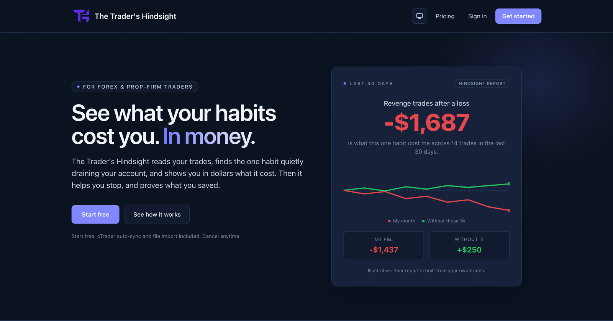
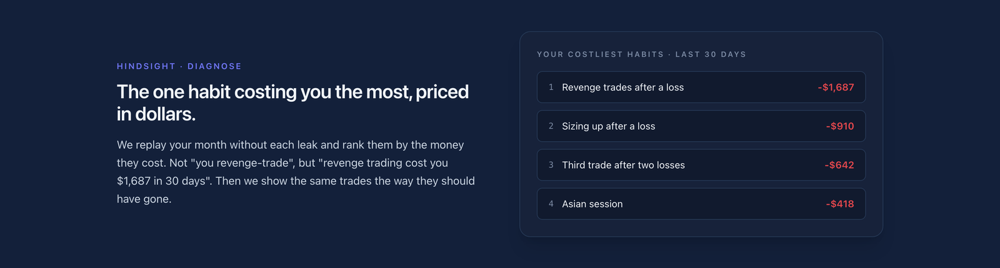
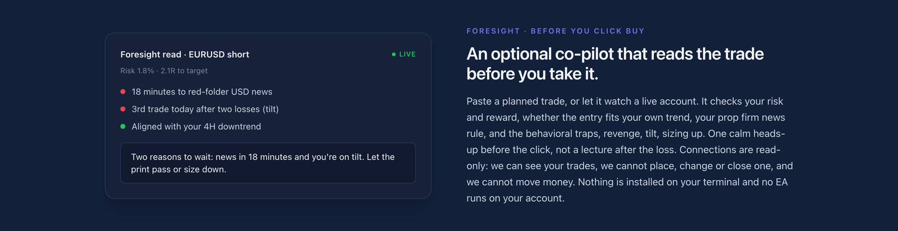
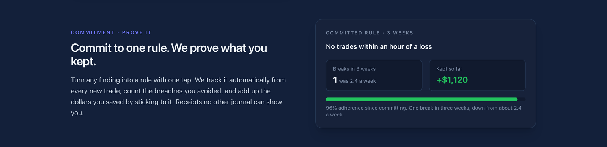
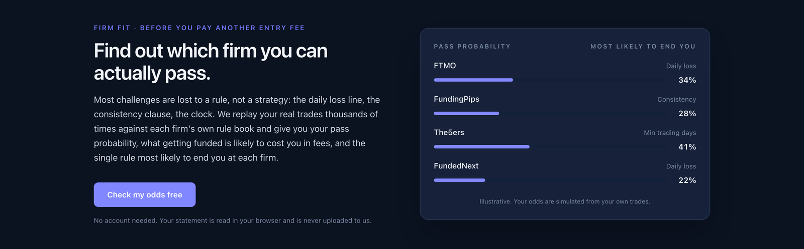

# The Trader's Hindsight

> Make your experience your edge.

A live subscription SaaS for forex and prop-firm traders. It reads a trader's trades, finds the one habit quietly draining the account, and shows in dollars what that habit cost. Then it helps them stop, and proves what they saved.

**Live:** [tradershindsight.com](https://tradershindsight.com)  
**Code:** private. This repository is a showcase only. A code walkthrough is available on request.  
**Built by:** [Prosper Osaigbovo](https://www.linkedin.com/in/prosperosaigbovo), founder of Hindsight Trade Analytics Limited. I designed, built and run it end to end.

## Why I built it

From June 2025 to September 2026 I took 20 prop-firm challenges across four firms. I was $4,428 down, net of refunds, and never funded. My journal recorded every trade, but it never told me which habit was costing me money. So I built one that does.

## What it does

- **Hindsight.** Replays the trader's month without each costly habit and ranks the habits by the dollars they cost. Not "you revenge-trade", but "revenge trading cost you $1,687 in 30 days".
- **Foresight.** An optional, read-only co-pilot. As each trade opens it sends the trader a Telegram risk check: trend across timeframes, reward-to-risk, money at risk against their limit, correlated positions and upcoming news. It reports how each warning played out and grades its own warnings A to F against real results.
- **Commit and prove.** Turn any finding into a rule with one tap. Every new trade is checked against it, and the dollars kept are added up.
- **Firm Fit.** Simulates the trader's real trades against each prop firm's rule book to estimate their pass probability. Statements are parsed in the browser and never uploaded.
- **Prop-firm rule tracking.** Per-firm rules for FTMO, FundingPips, FundedNext, The5ers and Alpha Capital. Breached accounts are disconnected automatically.
- **Insight.** An AI coach on the Anthropic (Claude) API that analyses the trader's full history.
- **Trade ingestion.** Read-only automatic sync from cTrader (Open API) and MetaTrader on scheduled background jobs, plus CSV/Excel import from cTrader, MetaTrader, TradeLocker, DXtrade and MatchTrader. Trades are auto-tagged by session, instrument and behavioural pattern.

## How it's built

| Layer | Choice |
| --- | --- |
| Framework | Next.js 16 (App Router), React 19, TypeScript |
| Data, auth, storage | Supabase (PostgreSQL) |
| Billing | Flutterwave (cards) and NOWPayments (crypto), via webhooks |
| Messaging | Telegram Bot API |
| AI | Anthropic (Claude) API |
| Monitoring | Sentry |
| CI | GitHub Actions |

## Security

- Designed RLS-first: PostgreSQL Row-Level Security on user data.
- Multi-factor sign-in enforced at the database level, with recovery codes.
- Broker tokens are encrypted (sealed).
- Broker connections are read-only: the app can see trades, but cannot place, change or close one, and cannot move money.
- Every CI run scans the codebase for secrets, and dependencies are audited on a schedule.

## By the numbers

- 100,000+ lines of TypeScript
- 35+ pages and 95+ API routes
- 150+ SQL migrations, merged into one schema baseline
- 275+ automated test files (over 50,000 lines)

## Screenshots

**Hindsight: the costliest habits, priced in dollars**

**Foresight: a risk check before the trade**

**Commitment: proof of the rule kept**

**Firm Fit: pass probability per prop firm**

Screenshots are of the public landing page. The figures in them are illustrative.

## Contact

[LinkedIn](https://www.linkedin.com/in/prosperosaigbovo) · [tradershindsight.com](https://tradershindsight.com)
